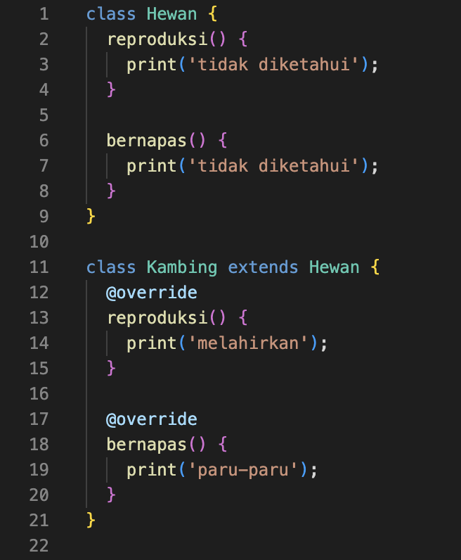
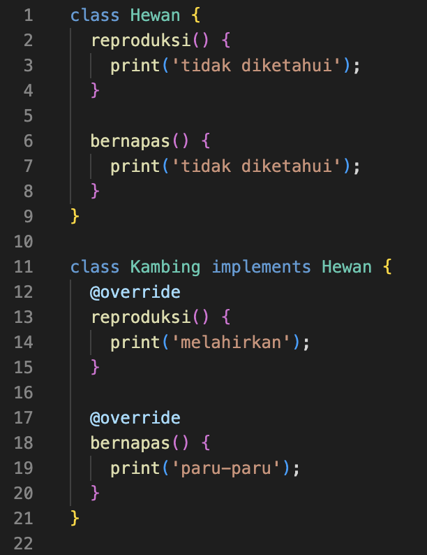

# (11) Dart Object Oriented Programming 2


## Data Diri
Nomor Urut : 1_018FLC_0

Nama : Rayhan Naufal Herlano

## Summary 
### Constructor
Contructor :
>Merupakan method yang dijalankan saat pembuatan object, dapat menerima parameter, tidak memiliki return, dan nama sama dengan nama class.

Memberi Constructor :

Tambahkan method menggunakan nama sama dengan nama class
```
class Hewan {
    var mata;
    var kaki;

    Hewan() {
        mata = 0;
        kaki = 0;
    }
}
```

### Inheritance
Inheritance :
>Membuat class baru dengan memanfaatkan class yang sudah ada, dan bertujuan agar kemampuan class yang sudah ada dapat dimiliki oleh class baru

Melakukan Inheritance :

Menambahkan extends saat pembuatan class baru
```
class Kambing extends Hewan {
    Kambing() {
        mata = 2;
        kaki = 4;
    }
}
```
Penggunaan Class :

Proses membuat object dari class yang terjadi inheritance seperti pembuatan object pada umumnya.
```
void main() {
    var k1 = Kambing();
    print(k1.mata);

    var h1 = Hewan();
    print(h1.mata);
}
```

### Method Overriding
Method Overriding :
>Menulis ulang method yang ada pada super-class, dan bertujuan agar class memiliki method yang sama, dengan proses yang berbeda.

Melakukan Overrdiing :
```
1. Dilakukan pada class yang melakukan inheritance
2. Method sudah ada pada class induk
3. Method ditulis ulang seperti membuat method baru pada class anak
4. Ditambahkan tanda @override di baris sebelum method dibuat
```
Contoh penggunaan :



Penggunaan Class :

Proses membuat object dari class yang terjadi inheritance seperti pembuatan object pada umumnya.
```
void main() {
    var k1 = Kambing();
    k1.reproduksi();

    var h1 = Hewan();
    h1.reproduksi();
}
```

### Interface
Interface :
>Berupa class, menunjukkan method apa saja yang ada pada suatu class, seluruh method wajib di-override, dan digunakan dengan implements

Menggunakan interface :
```
1. Sekilas mirip inheritance
2. Pada class yang melakukan implements, wajib melakukan override semua method yang ada pada class induk
```

Contoh penggunaan :


Penggunaan Class :

Proses membuat object dari class yang terjadi inheritance seperti pembuatan object pada umumnya.
```
void main() {
    var k1 = Kambing();
    k1.reproduksi();
    k1.bernapas();

    var h1 = Hewan();
    h1.reproduksi();
    h1.bernapas();
}
```

### Abstract Class
Abstract Class :
>Berupa class abstrak, menunjukkan method apa saja yang ada pada suatu class, digunakan dengan menggunakan extends, tidak dapat dibuat object dan tidak semua method harus di-override.

Contoh penggunaan :


Penggunaan Class :

```
void main(){
    var k1 = Kambing();
    k1.reproduksi();
    k1.bernapas();
}
```

### Polymorphism
Polymorphism :
>Kemampuan data berubah menjadi bentuk lain, tipe data yang dapat digunakan adalah super class, dan dapat dilakukan pada class dengan extends atau implements.

Melakukan Polymorphism :

Object dari class Kambing dengan tipe data class Hewan
```
void main(){
    Hewan k1 = Kambing();
    k1.reproduksi();
    k1.bernapas();
}
```

### Generics
Generics : 
>Dapat digunakan pada class atau fungsi, memberi kemampuan agar dapat menerima data dengan tipe yang berbeda, dan tipe data yang diinginkan ditentukan saat membuat class atau menjalankan fungsi.

Membuat Class dengan Generics :
```
1. Class hadiah dapat dimasukkan data dengan tipe T
2. Tipe T dapat digunakan di seluruh class Hadiah
```
```
class Hadiah<T> {
    var isi;

    Hadiah(T i){
        isi = i;
    }
}
```
Menggunakan Class dengan Generics :

Setelah nama class, menjadi tempat tipe data yang diinginkan
```
void main() {
    var h1 = Hadiah<String>('mobil');
    print(h1.isi);

    var h2 = Hadiah<int>(10);
    print(h2.isi);
}
```
Membuat Fungsi dengan Generics :

Setelah nama fungsi, menjadi tempat variabel generics
```
void cektipe<T>(T data) {
    print(data.runtimeType);
}
```
Menggunakan Fungsi dengan Generics :

Setelah nama fungsi, menjadi tempat tipe data yang diingkan
```
void main(){
    cekTipe<String>("Satu");
    cekTipe<int>(1);
}
```