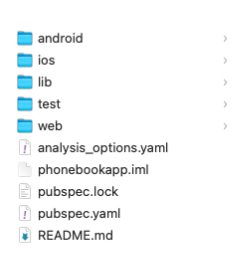

# (12) Introduction Flutter Widget


## Data Diri
Nomor Urut : 1_018FLC_0

Nama : Rayhan Naufal Herlano

## Summary 
### Flutter
Flutter
>Flutter adalah alat pengembangan antarmuka pengguna yang digunakan untuk membuat aplikasi mobile, desktop, dan web.

Keunggulan Flutter :
```
1. Mudah digunakan dan dipelajari
2. Produktivitas tinggi
3. Dokumentasi lengkap
4. Komunitas yang berkembang
```

Bagian dari Flutter :
```
1. SDK (Software Development Kit)
alat-alat untuk membantu proses pengembangan aplikasi
2. Framework
perlengkapan untuk membentuk aplikasi yang dapat dikustomisasi
```

Membuat Project :

Dilakukan dengan menjalankan perintah :
```
flutter create <nama_project>
```

Menjalankan Project :
```
1. Masuk ke direktori project
2. Jalankan perintah: flutter run
```

Struktur Direktori



Direktori platform :
- android
- ios
- web
Direktori project : 
- lib : ruang kerja utama
- test : aktivitas pengujian

File Utama bernama main.dart, merupakan : 
```
- Pertama kali dibaca dan dijalankan
- Dalam direktori lib
- Memiliki fungsi main
- Menjalankan aplikasi dengan fungsi runApp
```

main.dart :
```
import 'package:flutter/material.dart';
void main() => runApp(MyApp());
```

### Widget
Widget :
>Digunakan untuk membentuk antarmuka (UI), berupa class, dan dapat terdiri dari beberapa widget lainnya.

Jenis widget :
1. Stateless
2. Stateful

Stateless Widget :
>Tidak bergantung pada perubahan data, hanya fokus pada tampilan, dan dibuat dengan extends pada class StatelessWidget.

Membuat Stateless Widget :


Stateful Widget :
>Mementingkan pada perubahan data, dibuat dengan extends pada class StatefulWidget, dan 1 widget menggunakan 2 class (widget dan state).

Membuat Stateful Widget


### Built in Widget
>Build in widget adalah widget yang dapat langsung digunakan dan sudah ter-install bersama flutter

Material App:

Membangun aplikasi dengan desain material


Scaffold :

Membentuk sebuah halaman


Appbar :

Membentuk aplication bar yang terletak pada bagian atas halaman


Text :

Menampilkan teks


Hasil :


Output :


