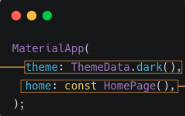
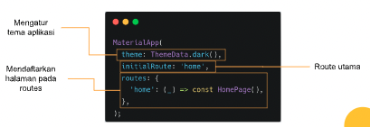
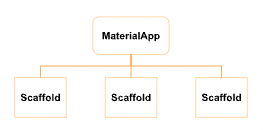
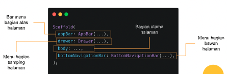
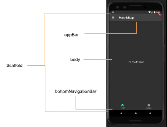
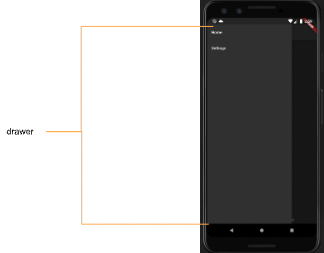
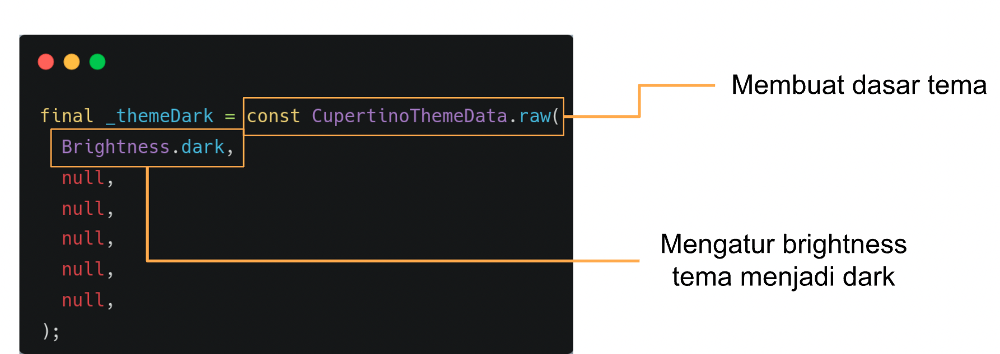
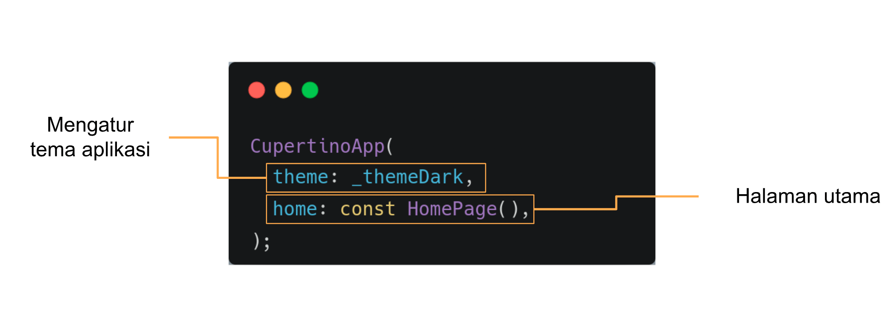
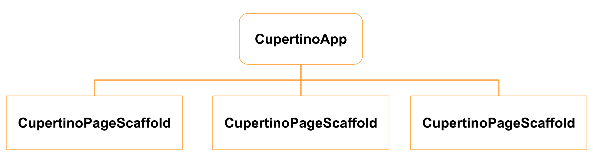
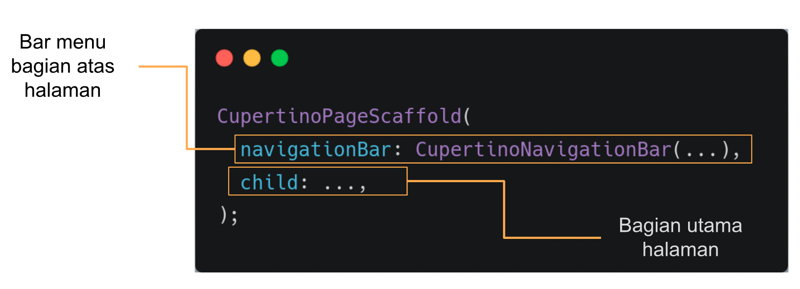

# (13) Platform Widget

## Data Diri
Nomor Urut : 1_018FLC_0

Nama : Rayhan Naufal Herlano

## Summary 
### Material App
Material App
>Material app adalah widget dasar yang mengesa seluruh widget dalam aplikasi, widget yang digunakan pada sistem android dan di-import dari package:flutter/material.dart

Struktur
>Widget yang pertama kali dibuka, diletakkan pada bagian home.

theme: ThemeData.dark() =  berfungsi untuk mengatur tema aplikasi,
home: const HomePage() = merupakan halaman utama

>Struktur untuk mengatur halaman juga dapat dilakukan dengan menggunakan routers dan initialRoute.

### Scaffold
Scaffold
>Scaffold merupakan widget dasar untuk membangun sebuah halaman pada MaterialApp

Struktur scaffold
>Membentuk tata letak dasar sebuah halaman yang ditulis melalui properti-properti

### CupertinoApp
Cupertino App
>Cupertino app adalah widget dasar yang mengemas seluruh widget dalam aplikasi, widget yang digunakan pada sistem iOS, dan di-import dari package:flutter/cupertino.dart

Struktur cupertino app
>Variabel _themeDark dibuat untuk menyimpan data. Diperlukan karena Cupertino tidak menyediakan ThemeData.dark() seperti pada Material

Struktur cupertino app
>Widget yang pertama kali dibuka, diletakkan pada bagian home.

### CupertinoPageScaffold
Cupertino Page Scaffold
>Cupertino Page Scaffold adalah widget dasar untuk membangun sebuah halaman pada CupertinoApp

Struktur Cupertino Page Scaffold
>Membentuk tata letak dasar sebuah halaman yang ditulis melalui properti-properti

