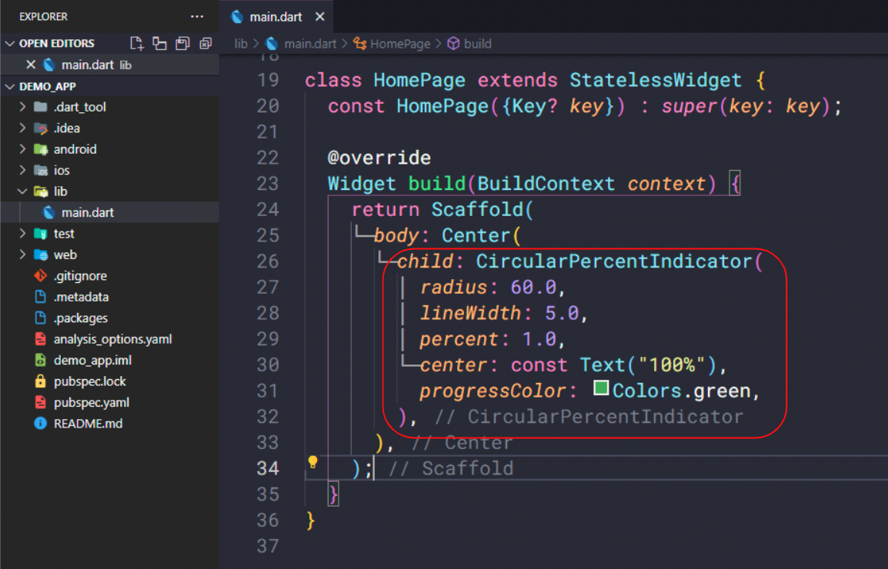

# (14) Flutter Command Line Interface (CLI) and Flutter package management


## Data Diri
Nomor Urut : 1_018FLC_0

Nama : Rayhan Naufal Herlano

## Summary 
## Flutter CLI
Flutter CLI
>FLutter CLI adalah alat yang digunakan untuk berinteraksi dengan Flutter SDK. Perintah Flutter CLI dijalankan dalam terminal

Important CLI Commands
```
1. Flutter Doctor
2. Flutter Create
3. Flutter Run
4. Flutter Emulator
5. Flutter Channel
6. Flutter Pub
7. Flutter Build
8. Flutter Clean
```

### Flutter Doctor
>Perintah untuk menampilkan informasi software yang dibutuhkan flutter
```
flutter doctor
```
### Flutter Create
>Perintah untuk membuat project aplikasi flutter baru di directory
```
flutter create <APP_NAME>
```

### Flutter Run
>Perintah untuk menjalankan project aplikasi di device yang tersedia
```
flutter run <DART_FILE>
```

### Flutter Emulator
>Perintah untuk menampilkan daftar emulator yang terinsatall dan menampilkan option untuk membuka emulator atau membuat emulator baru
```
> flutter emulators
> flutter emulators --launch <EMULATOR_ID>
> flutter emulators --create [--name xyz]
```

### Flutter Channel
>Perintah untuk menampilkan daftar flutter channel yang tersedia dan menunjukan channel yang digunakan saat ini.
```
flutter channel
```

### Flutter Pub
Ada dua syntax yang bisa digunakan, yaitu :

1. Flutter pub add, untuk menambahkan packages ke dependencies yang ada di pubspec.yaml
    ```
    flutter pub add <package_name>
    ```
2. Flutter pub get, untuk mendownload semua packages atau dependencies yang ada di pubspec.yaml
    ```
    flutter pub get
    ```


### Flutter Build
>Perintah untuk memproduksi sebuah file aplikasi untuk keperluan deploy atau publikasi ke AppStore, PlayStore, dll.
```
flutter build <DIRECTORY>
```

### Flutter Clean
>Perintah untuk menghapus folder build serta file lainnya yang dihasilkan saat kita menjalankan aplikasi di emulator. Perintah ini akan memperkecil ukuran project tersebut.
```
flutter clean
```

## Packages Management
Package Management :
Deskripsi : 

- Flutter mendukung sharing packages
- Packages dibuat developer lain
- Mempercepat pengambangan aplikasi karena tidak perlu membuat semuanya dari awal atau from scratch
- Mendapatkan packages di website [pub.dev](https://pub.dev/)

### Cara Menambahkan Packages
- Cari package di [pub.dev](https://pub.dev/)
- Copy baris dependencies yang ada di bagian installing
- Buka pubspec.yaml
- Paste barisnya di bawah dependencies pubspec.yaml
- Run flutter pub get di terminal
- Import package di file dart agar bisa digunakan
- Stop atau restart aplikasi jika dibutuhkan

### Menggunakan Packages
Hanya membutuhkan beberapa baris kode untuk menghasilkan UI yang kompleks


