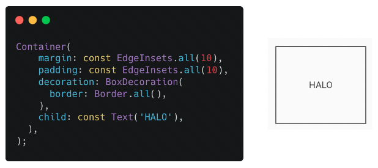
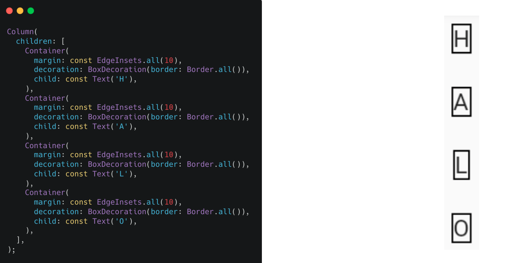
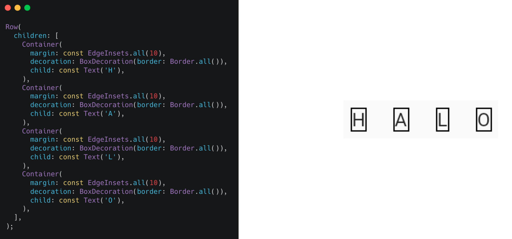
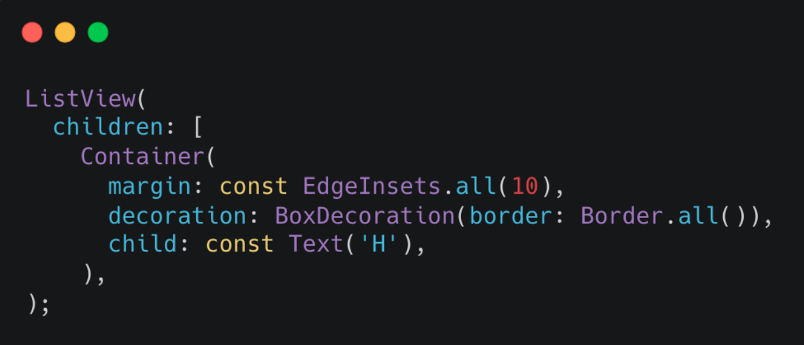
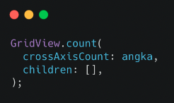

# (15) Flutter Layout

## Data Diri
Nomor Urut : 1_018FLC_0

Nama : Rayhan Naufal Herlano

## Summary 
## Flutter Layout
Layout
>Layout berfungsi untuk mengatur tata letak, dan layout berbentuk widget yang mengatur widget di dalamnya

### Single-child layout
Container
>Container digunakan untuk membuat sebuah box, membungkus widget lain, dan box memiliki margin, padding dan border

Penggunaan Container

Center
>Center digunakan untuk membuat sebuah box, membungkus widget lain, memenuhi lebar dan tinggi ruang di luarnya, dan meletakkan widget berada di bagian tengah

SizedBox
>SizedBox digunakan untuk membuat sebuah box, membungkus widget lain, box dapat diatur lebar dan tingginya, dan lebih sederhana dari container

### Multi-child layout
Column
>Mengatur widgets secara vertikal

Row
>Mengatur widgets secara horizontal

ListView
>Mengatur widgets dalam bentuk list dan memiliki kemampuan scroll

GridView
>Mengatur widgets dalam bentuk galeri

