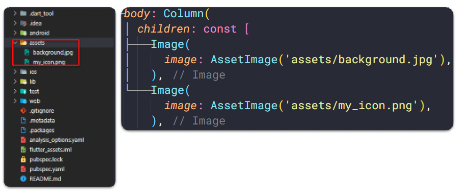
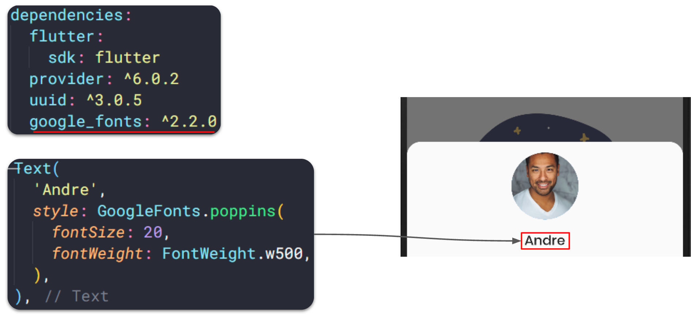

# (16) Flutter Layout


## Data Diri
Nomor Urut : 1_018FLC_0

Nama : Rayhan Naufal Herlano

## Summary 
## Assets
Assets
>Merupakan file yang dibundled dan dideployed bersamaan dengan aplikasi, tipe-tipe assets, seperti: static data (JSON files), icons, images dan font file (tff)

Menentukan Assets
```
- Flutter menggunakan pubspec.yaml
- Pubspec.yaml terletak pada root project, untuk mengidentifikasi assets yang dibutuhkan aplikasi
- Gunakan karakter "/" untuk memasukkan semua assets di bawah satu directory name
```


### Image
>Image atau gambar akan membuat tampilan aplikasi menjadi lebih menarik, flutter mendukung format gambar seperti JPEG, WebP, GIF, Animated Web/GIF, PNG, BMP, dan WBMP, dan image menampilkan gambar dari project asset dan internet.

Loading Images
- Gunakan widget image
- Membutuhkan properti image dengan nilai class AssetImage()
- Menggunakan method Image.asset, mendapatkan image yang sudah ditambahkan dalam project
- Menggunakan method Image.network, mendapatkan data image melalui internet dengan menggunakan string url nya




### Font
```
- Penggunaan font dengan style tertentu akan menjadi keunikan pada aplikasi
- Penentuan font yang mau dipakai biasanya oleh UI designer
- Penerapan font menggunakan custom font atau dari package
```

Custom Font

Cara menggunakan custom font:
- Cari dan download font contohnya di : [Link](https://fonts.google.com/)
- Import file .tff
- Daftarkan font di pubspec.yaml


- Mengatur font sebagai default


- Gunakan font dispesifik widget 


Font dari Package

Cara menggunakan font dari package:
- Tambahkan package google_fonts di dependencies


- Import package di file dart


## Aplikasi Task Management (Continue)
Menambahkan image pada empty_task_screen.dart


Membuat profile picture di profile_sheet.dart, menggunakan CircleAvatar


Menambahkan font pada setiap text



