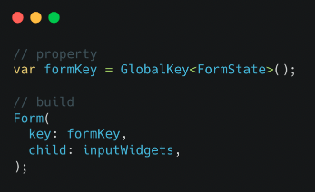
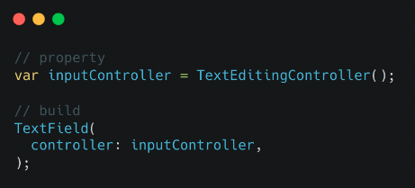
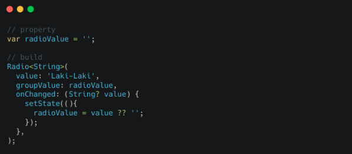
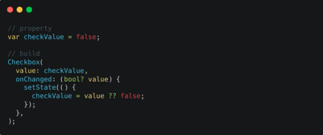
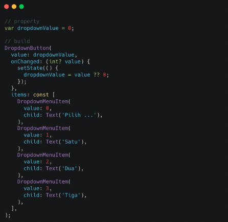
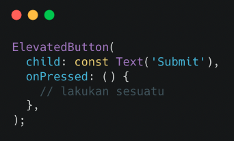
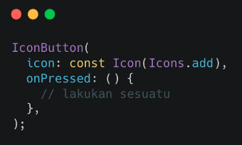

# (17) Form Input Button


## Data Diri
Nomor Urut : 1_018FLC_0

Nama : Rayhan Naufal Herlano

## Summary 
## Flutter Form
### Form
>Form berfungsi untuk menerima isian data dari pengguna, dan isian data dapat lebih dari satu.

Membuat Form
```
Menggunakan StatefulWidget
Keadaan form disimpan menggunakan GlobalKey<FormState>
```



### Input
Text Field
>Berfungsi untuk menerima isian data dari pengguna dan isian data dapat lebih dari satu.

Membuat TextField
```
Data diambil menggunakan TextEditingController
Isian data berupa teks
```


Radio
>Berfungsi untuk memberi opsi pada pengguna dan hanya dapat memilih satu opsi.

Membuat Radio

Data diambil menggunakan property dengan tipe data sesuai value pada radio



Checkbox
>Berfungsi untuk memberi opsi pada pengguna dan dapat memilih beberapa opsi

Membuat Checkbox

Data diambil menggunakan property bertipe bool



Dropdown Button
>Berfungsi untuk memberi opsi pada pengguna, hanya dapat memilih satu opsi, dan opsi tidak ditampilkan di awal, hanya tampil jika ditekan

Membuat DropdownButton

Data diambil menggunakan property dengan tipe data sesuai value pada DropdownaMenuItem



### Button
Button
>Bersifat seperti tombol, dan dapat melakukan seseatu saat ditekan

ElevatedButton
>Merupakan tombol yang timbul, dan jika ditekan akan menjalankan onPressed



IconButton
>Merupakan tombol yang hanya menampilkan icon, dan jika ditekan akan menjalankan onPressed



