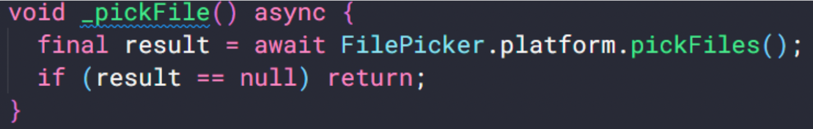

# (18) Form Picker


## Data Diri
Nomor Urut : 1_018FLC_0

Nama : Rayhan Naufal Herlano

## Summary 
### Interactive Widgets
```
Interaksi antara aplikasi dan user
Mengumpulkan input dan feedback dari user
```

Menambahkan Layout

Layout untuk menyusun interactive widget


## Date Picker
Date Picker
>Merupakan widget dimana user bisa memasukkan tanggal, tanggal yang biasa digunakan berupa tanggal kelahiran, waktu pemesanan tiket, waktu reservasi restoran, jadwal meeting, dll.

Cara membuat Date Picker
```
- Menggunakan fungsi bawaan flutter showDatePicker
- Fungsi showDatePicker memiliki tipe data future
- Menampilkan dialog material design date picker
```

Cara menggunakan Date Picker
- Menambahkan packages intl di pubspec.yaml
- Mempersiapkan variabel


- Membangun UI


- Menambahkan fungsi show Date Picker di dalam onPressed


- Memanggil fungsi setState di dalam onPressed


Hasil Akhir

- Saat select button ditekan akan menuncul dialog date picker
- Tanggal yang ada di UI akan berubah sesuai dengan tanggal yang dipilih


## Color Picker
Color Picker
>Merupakan widget dimana user bisa memilih color, dan penggunaan color picker bisa digunakan untuk berbagai macam kondisi.

Cara membuat Color Picker
- Menggunakan packages flutter_colorpicker
- Menambahkan packages flutter_colorpicker di pubspec.yaml
- Mempersiapkan variabel


- Membangun UI


- Menambahkan fungsi showDialog di dalam onPressed dengan return widget AlertDialog


- Import packages flutter_colorpicker dalam file dart
- Membuat kode untuk penggunaan packages flutter_colorpicker


Hasil Akhir
- Packages flutter_colorpicker memiliki custom widget yang dapat digunakan seperti BlockPicker, ColorPicker, dan SlidePicker


## File Picker
>Merupakan kemampuan widget untuk mengakses storage, memilih dan membuka file

Cara membuat File Picker
- Menggunakan packags file_picker dan open_file
- Menambahkan packages file_picker dan open_file di pubspec.yaml
- Import packages file_picker dan open_file dalam file dart
- Membangun UI


- Membuat fungsi untuk mengexplore dan memilih files dari storage



- Memanggil fungsi _pickFile di dalam onPressed


- Membuat fungsi untuk membuka files yang telah dipilih


- Mengambil file dari object result dan memanggil fungsi _openFile di dalam fnugsi _pickfile


Hasil Akhir
- Ketika button ditekan maka akan membuka storage device dan file yang dipilih akan terbuka


