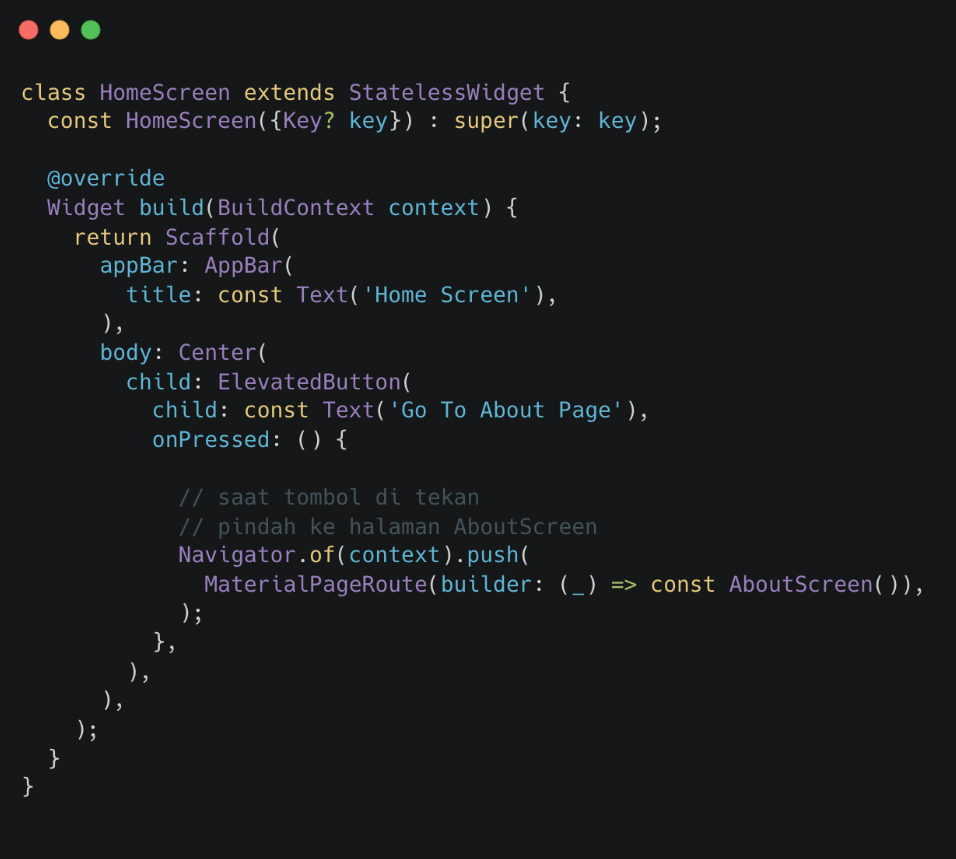

# (20) Flutter Navigation


## Data Diri
Nomor Urut : 1_018FLC_0

Nama : Rayhan Naufal Herlano

## Summary 
### Apa itu Navigation?
>Berpindah dari halaman satu ke halaman lain


### Navigation Dasar

1. Perpindahan halaman menggunakan 
```
Navigator.push()
```
2. Kembali ke halaman sebelumnya menggunakan
```
Navigator.pop()
```

Perpindahan Halaman

Home Screen :




About Page :


Mengirim Data ke Halaman Baru
>Menggunakan parameter pada constructor halaman


### Navigation dengan Named Routes
- Tiap halaman memiliki alamat yang disebut route, perpindahan halaman menggunakan 
```
Navigator.pushNamed()
```
- Kembali ke halaman sebelumnya menggunakan Navigator.pop()

Mendaftarkan Route
- Tambahkan initialRoute dan routes pada MaterialApp
- Tiap route adalah fungsi yang membentuk halaman


Perpindahan Halaman


Mengirim Data ke Halaman Baru


