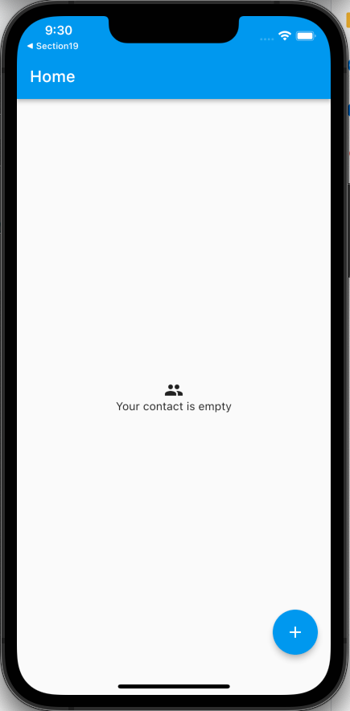
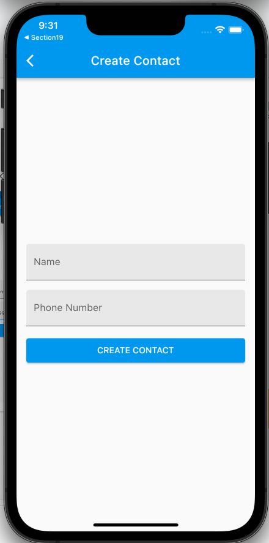
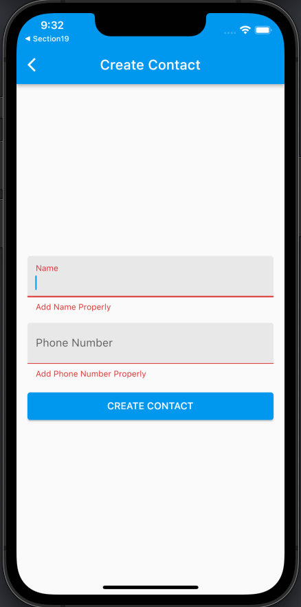
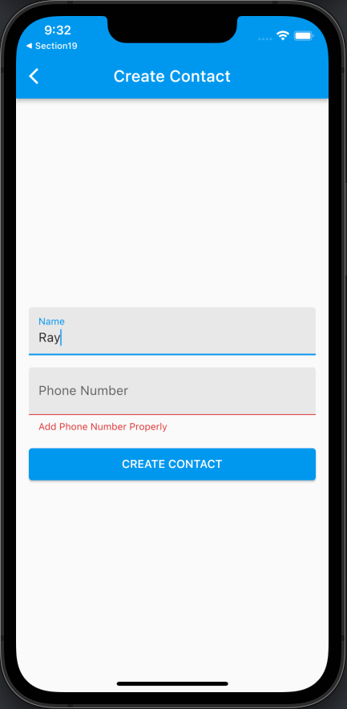
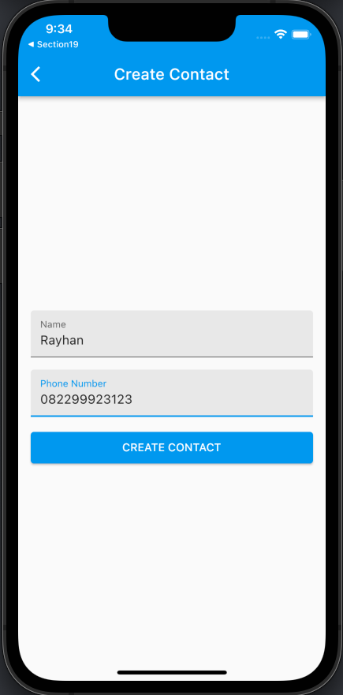
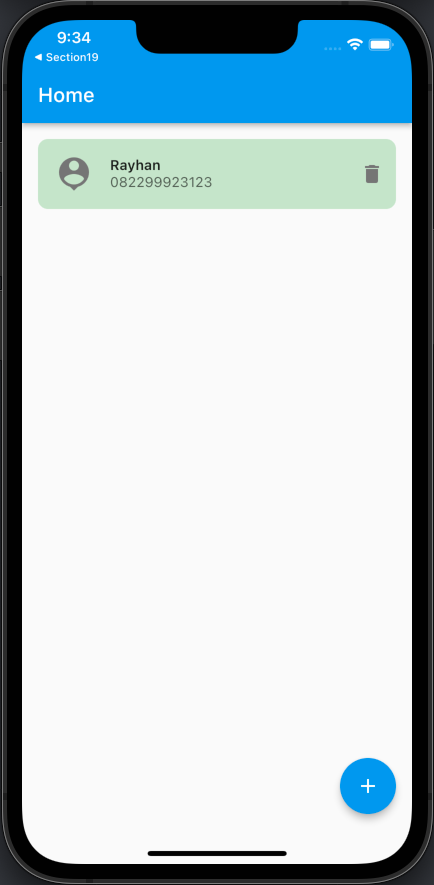
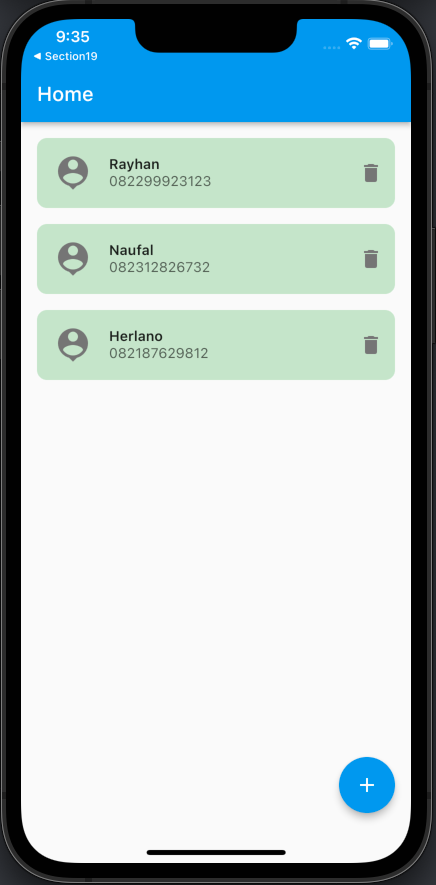
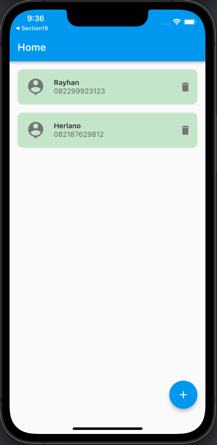

# (21) Flutter State Management (Provider)

## Data Diri
Nomor Urut : 1_018FLC_0

Nama : Rayhan Naufal Herlano

## Output
### Empty Contact Page (Home)

### Create Contact Page

### Add Contact Page (Not Filled)

### Add Contact Page (Phone not filled)

### Input & Output

Input :

Output :

All contacts :

Delete Name (Naufal) :

