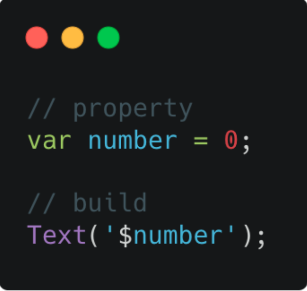
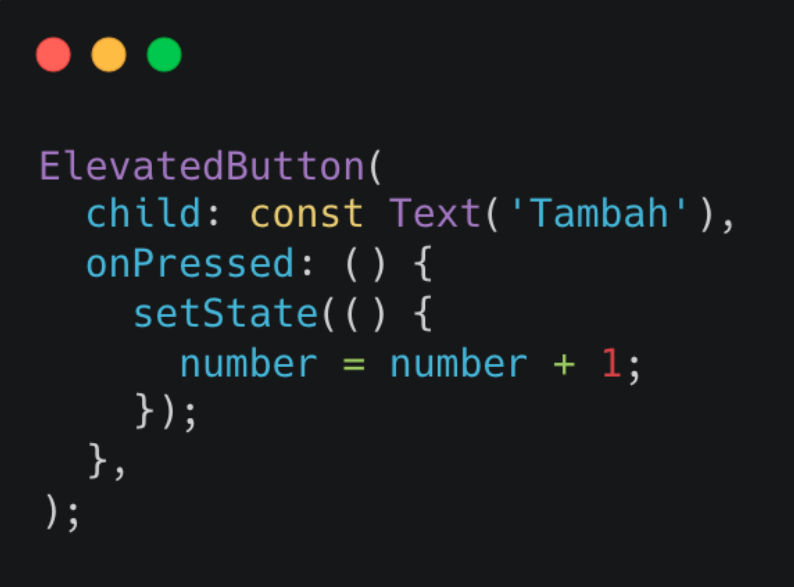
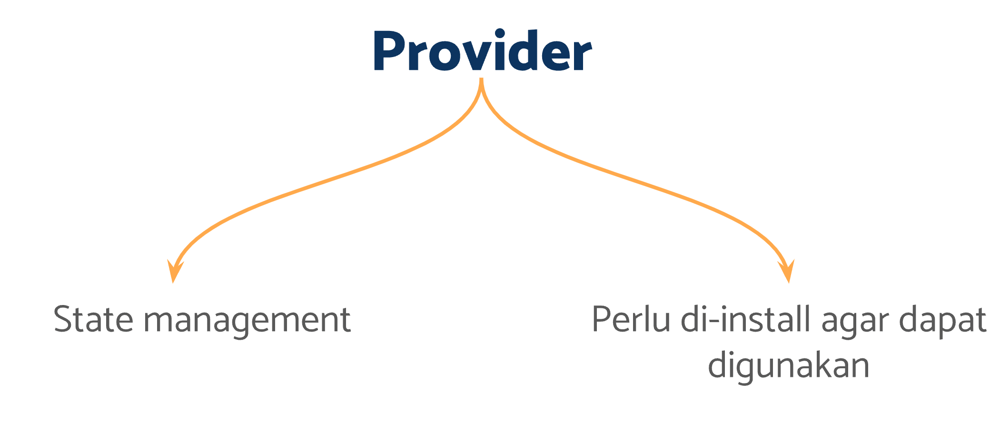
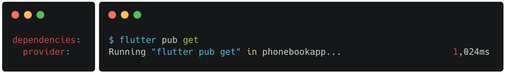
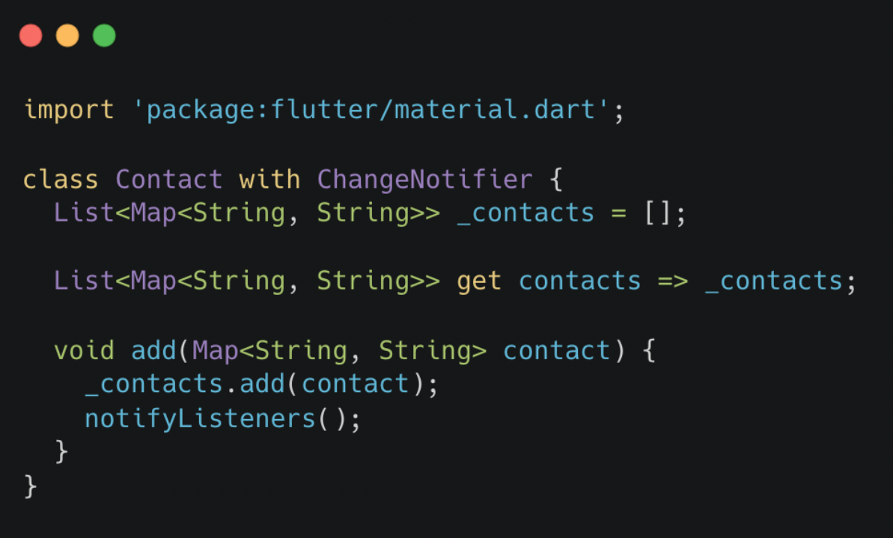
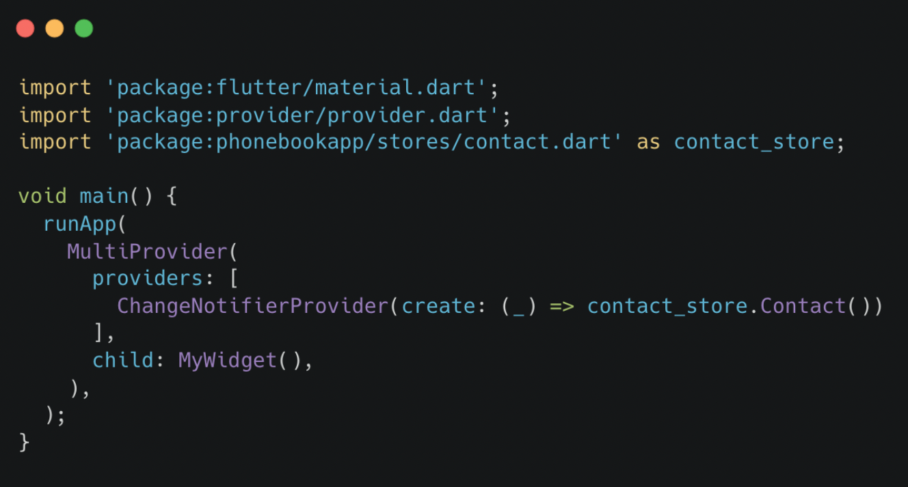
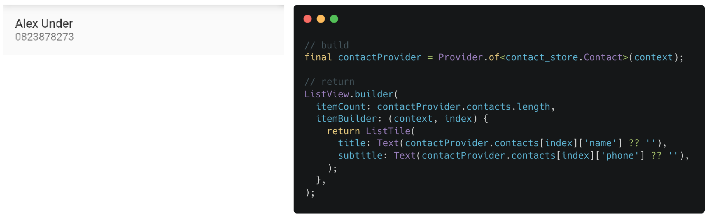

# (21) Flutter State Management (Provider)

## Data Diri
Nomor Urut : 1_018FLC_0

Nama : Rayhan Naufal Herlano

## Summary 
## Flutter Global State Management
### State
Dekripsi
```
- Data yang dapat dibaca saat pembuatan widget
- Dapat berubah saat widget sedang aktif
- Hanya dimiliki oleh StatefulWidget
```

Kenapa perlu Global State?
>Agar antara widget dapat memanfaatkan state yang sama dengan mudah.

Memanfaatkan State



- Dibuat sebagai property dari class
- Digunakan pada widget saat build.

Mengubah State
- Menggunakan method setState




### Global State
>Merupakan state biasa yang dapat digunakan pada seluruh widget




Instalasi Provider
- Menambahkan package provider pada bagian dependencies dalam file pubspec.yaml
- Jalankan perintah flutter pub get



Membuat State Provider
- Buat file bernama contact.dart
- Definisikan state dalam bentuk class



Mendaftarkan State Provider
- Import dalam file main.dart
- Daftarkan pada runApp dengan MultiProvider



Menggunakan State dari Provider
- Simpan provider dalam variable
- Ambil data dari provider melalui getter


