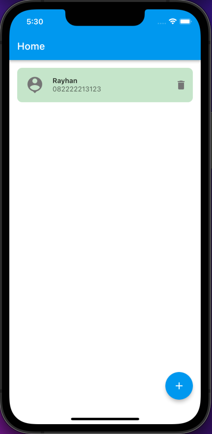
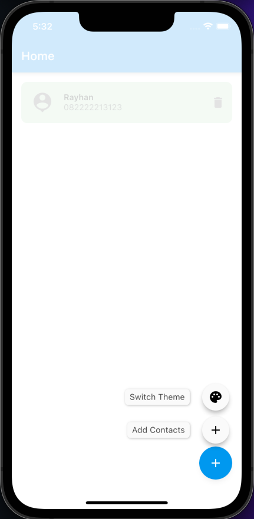
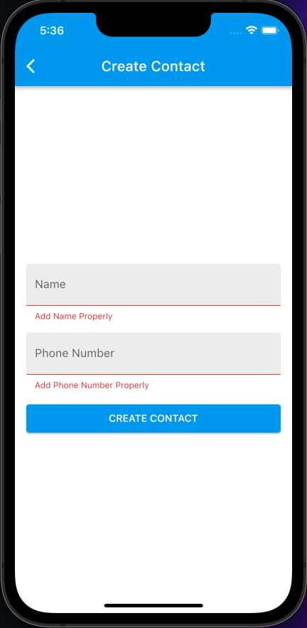
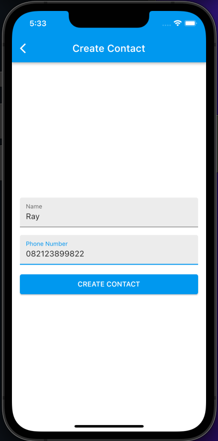
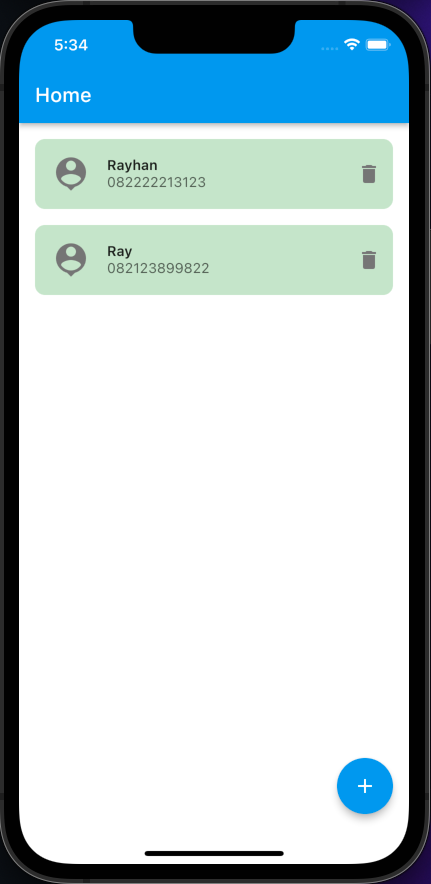
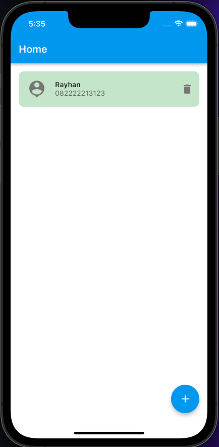
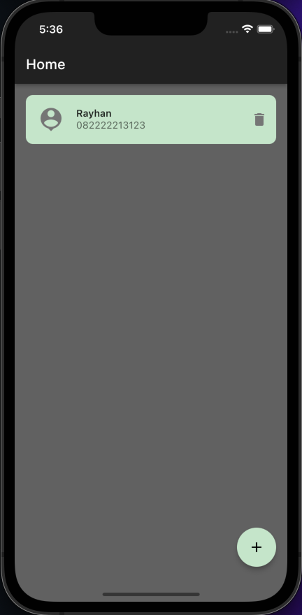

# (22) Flutter State Management (BLoC)

## Data Diri
Nomor Urut : 1_018FLC_0

Nama : Rayhan Naufal Herlano
## Output
### Home Page

### Floating Speed Dial

### Add Contact Page (Not Filled)

### Input & Output

Input :

Output :

Delete Name (Ray) :

### Switch Theme Floating Action Button (Speed Dial)

