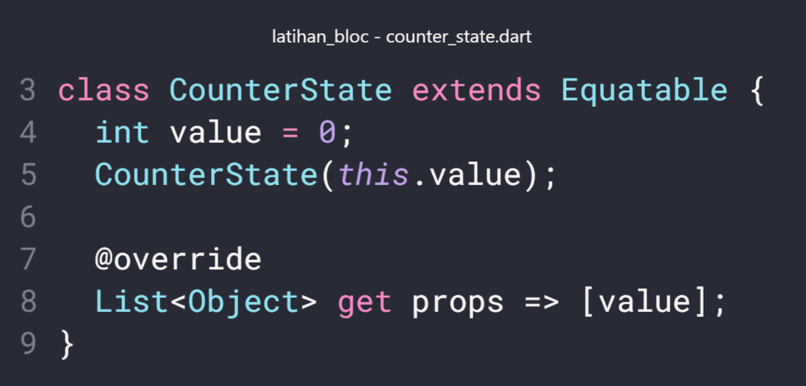
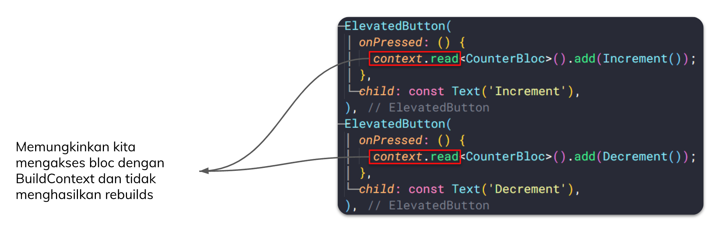

# (22) Flutter State Management (BLoC)

## Data Diri
Nomor Urut : 1_018FLC_0

Nama : Rayhan Naufal Herlano

## Summary 
## State Management
### Declarative UI
>Flutter memiliki sifat declarative yang artinya flutter membangun UI nya pada screen untuk mencerminkan keadaan state saat ini.


### State
```
- State adalah ketika sebuah widget sedang aktif dan widget
tersebut menyimpan data di memori
- Flutter akan membangun ulang UI nya ketika ada state atau data
yang berubah
- Ada 2 jenis state dalam flutter , ephemeral state dan app state
```

### Ephemeral State
```
1. Digunakan ketika tidak ada bagian lain pada widget tree yang
 membutuhkan untuk mengakses data widget nya , contohnya :
 - PageView
 - BottomNavigationBar
 - Switch Button .
2. Tidak perlu state management yang kompleks
3. Hanya membutuhkan StatefulWidget dengan menggunakan fungsi setState ()
```


### App State

Digunakan ketika bagian yang lain suatu aplikasi membutuhkan
 akses ke data state widget , contohnya :
 - Login info
 - Pengaturan preferensi pengguna
 - Keranjang belanja , dimana Informasi yang pengguna pilih di
 suatu screen yang mana informasi itu akan muncul di screen yang
 berbeda

Pendekatan State Management
- setState
 Lebih cocok penggunaan nya pada ephemeral state
- Provider
 Penggunaan untuk state management yang lebih kompleks seperti
 app state, pendekatan ini direkomendasikan oleh tim flutter karena
 mudah dipelajari
- Bloc
 Menggunakan pola stream / observable , untuk memisahkan UI
 dengan bisnis logic nya

### Bloc (Business Logic Component)
> BLoc memisahkan antara business logic dengan UI


Kenapa BLoc?


Cara kerja BLoc 
- Menerima event sebagai input
- Dianalisa dan dikelola di dalam BLoc 
- Menghasil state sebagai output


Stream
- Rangkaian proses secara asynchronous
- Actor utama di dalam BLoc


Latihan BLoc
- Membuat counter app dengan pendekatan state management BLoc
 


Step 1: Install Package


Step 2: Membuat Folder BLoc
- Buat 3 file dart baru, counter_bloc.dart, counter_event.dartm dan counter_state.dart
- Bisa buat secara manual atau buat dengan extensions di code editor


Step 3: Menambahkan Event
- Tambhahkan event di counter_event.dart


Step 4: Menambahkan State
- Tambahkan state untuk menyimpan nilai counter di counter_state.dart



Step 5: Menambahkan Logika Bisnis
- Tambahkan logika bisnis di counter_bloc.dart
- Gunakan fungsi emit untuk mengirim state terbaru


Step 6: Menambahkan BlocProvider
- Tambahkan BlocProvider di main.dart


Step 7: Membangun UI
- Buat folder baru screens, di dalamnya buat file baru home_page.dart

UI : 

Coding : 

Step 8: Menambahkan BlocBuilder
- Tambahkan BlocBuilder di home_page.dart


Step 9: Mengganti Text
- Menampilkan nilai terbaru yang dimiliki state


Step 10: Menambahkan context.read
- Tambahkan context.read pada fungsi onPressed ElevatedButton




