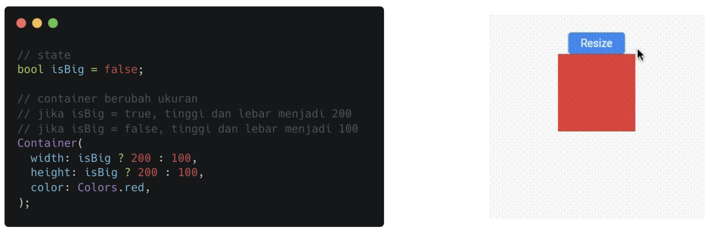

# (23) Flutter Animation

## Data Diri
Nomor Urut : 1_018FLC_0

Nama : Rayhan Naufal Herlano

## Summary 
### Animation
>Animasi dapat membuat aplikasi terlihat hidup, Widget yang bergerak menambah daya tarik, dan Pergerakan dari kondisi A ke kondisi B

### Implicit Animation
>Merupakan versi animasi dari widget yang sudah ada

Contoh :
Tanpa Animation
>Perubahan ukuran container tampak kaku

Dengan Animation
>Perubahan ukuran container menjadi lebih hidup dan nyaman dilihat

### Transition
>Merupakan animasi yang terjadi saat perpindahan halaman, dan dilakukan pada bagian Navigation.push()

### Transition yang umum

### Fade Transition
>Berfungsi untuk menampilkan halaman dengan efek redup menuju ke tampak jelas secara penuh

### Scale Transition
>Berfungsi untuk menampilkan halaman dengan efek berubah ukuran dan tidak penuh menuju tampilan keseluruhan

