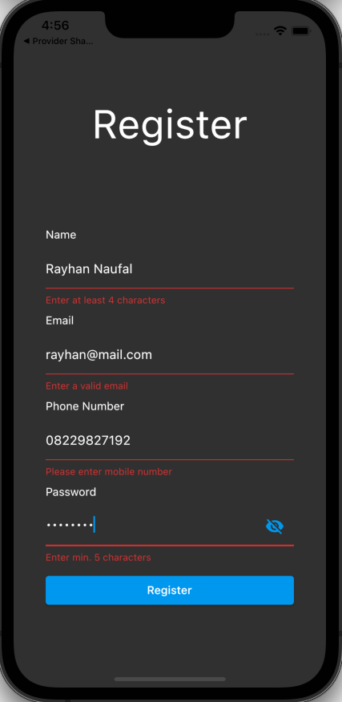

# (22) Flutter State Management (BLoC)

## Data Diri
Nomor Urut : 1_018FLC_0

Nama : Rayhan Naufal Herlano
## Output

## Task 1

### Register Page

### Field must be filled

### Input & Output

Input :

Output :

## Task 2

### Register Page

### Field must be filled

### Input & Output

Input :

Output :
