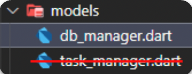
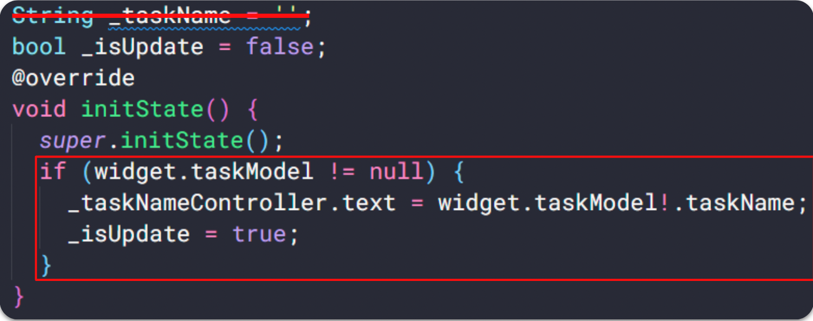

# (24) Storage

## Data Diri
Nomor Urut : 1_018FLC_0

Nama : Rayhan Naufal Herlano

## Summary 
### Penyimpanan Lokal
> Diperlukan untuk efisiensi penggunaan data internet. Ada beberapa cara implementasi penyimpanan lokal, contohnya seperti Shared Preferences, dan Local Database.

### Shared Preference
> Berfungsi untuk menyimpan data yang sederhana, penyimpanan dengan format key-value, menyimpan tipe data dasar seperti teks, angka dan boolean, dan biasa digunakan untuk menyimpan data login dan menyimpan riwayat pencarian.

### Implementasi Shared Preference
- Menambahkan shared preference pada fitur login
- STEP 1: Tambahkan package shared_preference

- STEP 2: Buat properti baru untuk TextEditingController dan tambahkan di setiap TextFormField

- STEP 3: Buat method dispose(), untuk menghindari kebocoran memori

- STEP 4: Buat variabel baru untuk menyimpan SharedPreference dan nilai bool newUser

- STEP 5: Buat method baru dengan nama checkLogin()

- STEP 6: Panggil method checkLogin() di method initState()

- STEP 7: Di dalam onPressed ElevatedButton, buat variabel baru username untuk menampung input dari user

- STEP 8: Buat setBool dan setString baru di dalam blok kode if, dan buat navigasi untuk ke halaman HomePage

- STEP 9: Buat file dart baru home_page.dart dan tambahkan UI nya

- STEP 10: (home_page.dart) Buat variabel baru untuk menyimpan SharedPreference dan usernam

- STEP 11: (home_page.dart) Buat method baru initial(), dan panggil di method initState()

- STEP 12: (home_page.dart) Mengganti text 'username' menjadi variabel username
- STEP 13: (home_page.dart) Tambahkan method setBool dan remove pada ElevatedButton

### Hasil Akhir :
- Ketika menekan login maka akan masuk ke home page dan menampilkan text username sesuai yang diinputkan di text form field

### Aplikasi Task Management (Continue)
- TODO 28: Menambahkan login screen pada aplikasi Task Management, dan menambahkan shared_preference package, dan email_validator package

- TODO 29: (main.dart) Mengganti home menjadi routes

- TODO 30: (profile_sheet.dart) Menambahkan kode untuk shared preference di profile sheet

### Local Database (SQLite)
> Berfungsi untuk menyimpan dan meminta data dalam jumlah besar pada local device, bersifat private, menggunakan SQLite database melalui package sqflite, dan SQLite merupakan database opem source yang mendukung Insert, Read, Update, Remove.

### Implementasi SQLite
- TODO 31: Menambahkan package sqflite dan path (pubspec.yaml), pastikan import packages nya di file dart yang ktia kerjakan

- TODO 32: (task_model.dart) Membuat model/modifikasi model yang sudah ada, dan membuat fungsi toMap dan fromMap

- TODO 33: Buat folder baru helper, dan di dalamnya buat file dart baru database_helper.dart

- TODO 34: (database_helper.dart) Buat kelas baru DatabaseHelper dan tambahkan factory constructor

- TODO 35: (database_helper.dart) Membuat objek database

- TODO 36: (database_helper.dart) Membuka koneksi ke database dan membuat tabelnya

- TODO 37: (database_helper.dart) Membuat method untuk menambahkan data ke tabel

- TODO 38: (database_helper.dart) Membuat method untuk membaca data

- TODO 39: (database_helper.dart) Membuat method untuk mengambil data dengan id

- TODO 40: (database_helper.dart) Membuat method untuk memperbarui data

- TODO 41: (database_helper.dart) Membuat method untuk menghapus data

- TODO 42: Membuat file dart baru db_manager.dart

- TODO 43: (db-manager.dart) Membuat Constructor untuk membuat instance kelas DatabaseHelper

- TODO 44: (db_manager.dart) Membuat method _getAllTasks

- TODO 45: (db_manager.dart) Membuat method addTask, getTaskById, updatetask, dan deleteTask

- TODO 46: (main.dart) Mengganti providernya menjadi DbManager

- TODO 47: (task_screen.dart) Mengganti Consumer yang ada di buildTaskScreen menjadi DbManager

- TODO 48: (task_screen.dart) Mengganti kode yang ada di onPressed FloatingActionButton

- TODO 49: (task_item_screen.dart) Menghapus properti onCreate dan membuat properti baru taskModel

- TODO 50: (task_item_screen.dart) Menghapus properti _taskName, buat properti baru _isUpdate, dan ganti kode pada blok method initState()

- TODO 51: (task_item_screen.dart) Mengganti kode yang ada di blok kode onPressed buildButton()

- TODO 52: (task_list_screen.dart) Mengganti TaskManager menjadi DbManager

- TODO 53: (task_list_screen.dart) Membungkus ListView.separated dengan Consumer<'DbManager'>(). dan pindahkan variabel taskItems di dalam builder Consumer

- TODO 54: (task_list_screen.dart) Menghapus key yang ada di widget TaskItemCard, dan ganti index untuk deleteTask nya menggunakan item.id!

- TODO 55: (task_list_screen.dart) Membungkus widget TaskItemCard dengan widget InkWell dan gunakan onTap dengan fungsi async. Di dalam blok fungsi nya tambahkan variabel selectedTask yang menampung item.id! dan tambahkan navigasi ke TaskItemScreen

[Download](https://bit.ly/3J8dinV)

