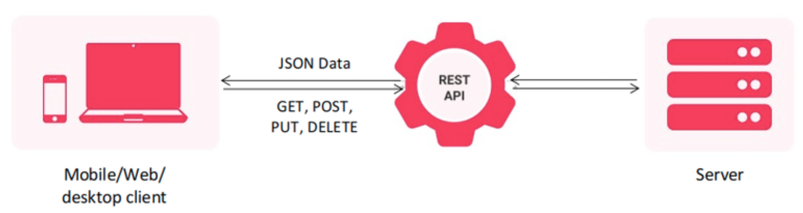
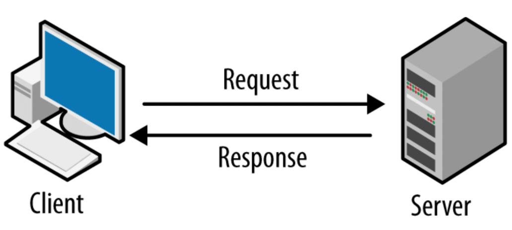
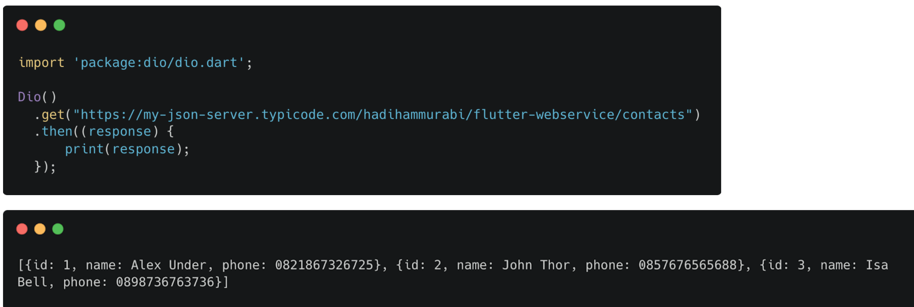
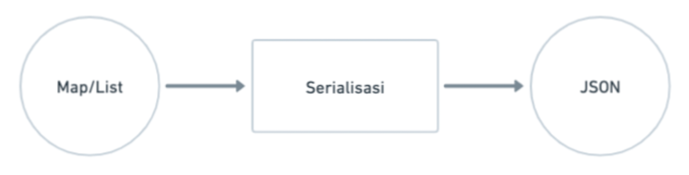
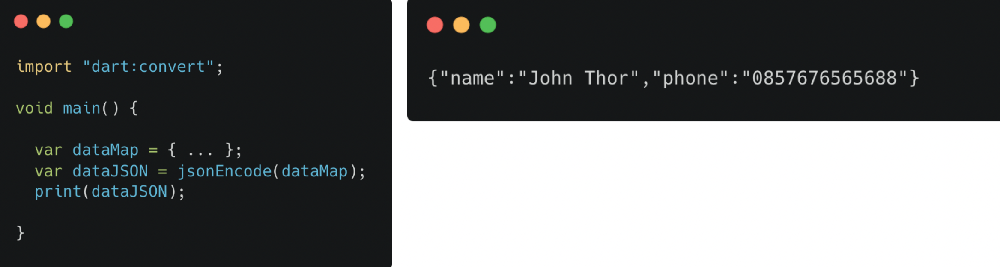
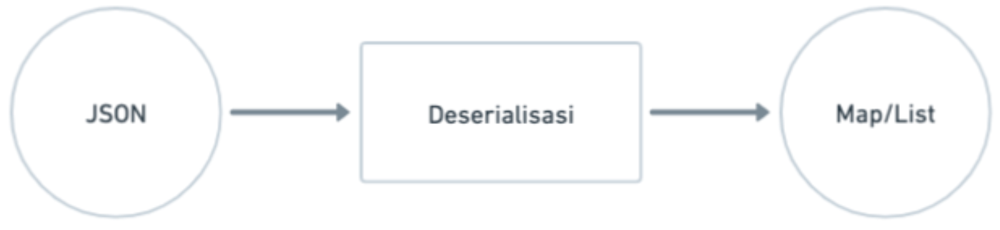
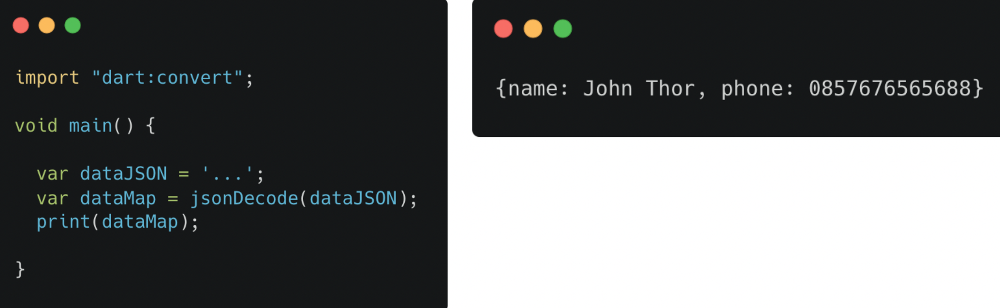

# (25) Introduction REST API - JSON serialization/deserialization

## Data Diri
Nomor Urut : 1_018FLC_0

Nama : Rayhan Naufal Herlano

## Summary 
### REST API CLient
RESTI API (Representational State Transfer Application Programming Interface)
> Merupakan arsitektural yang memisahkan tampilan dengan proses bisnis. Bagian tampilan dengan proses bisnis berkirim data melalui HTTP Request



### HTTP
>HTTP merupakan protokol yang digunakan untuk berkirim data pada internet, biasanya data tersebut berbentuk media web

Pola Komunikasi



\- Client mengirim request

\- Server mengolah dan membalas dengan memberi response

Struktur Request

1. URL
    
    Alamat halaman yang akan diakses

2. Method (GET, POST, PUT, DELETE)
    
    Menunjukkan aksi yang diinginkan

3. Header

    Informasi tambahan terkait request yang dikirimkan

4. Body

    Data yang disertakan bersama request

Struktur Response

1. Status Code

    Kode yang mewakili keseluruhan response, baik sukses maupun gagal

2. Header

    Informasi tambahan terkait response yang diberikan

3. Body

    Data yang disertakan bersama response

### Dio
>Dio berfungsi sebagai HTTP Client, dan dimanfaatkan untuk melakukan REST API

Instalasi
- Tambahkan dependency [dio](https://pub.dev/packages/dio) pada pubspec.yaml
- Jalankan perintah flutter pub get pada terminal

Penggunaan 
> Mengambil data menggunakan Dio dan menampilkan hasilnya pada console



### Serialisasi JSON
Deskripsi :
```
- Cara penulisan data
- Javascript Object Notation
- Umum digunakan pada REST API
```

- Mengubah struktur data ke bentuk JSON



- Menggunakan fungsi jsonEncode dari package dart:convert



### Desearialisasi JSON

- Mengubah bentuk JSON ke struktur data



- Menggunakan fungsi jsonDecode dari package dart:convert




