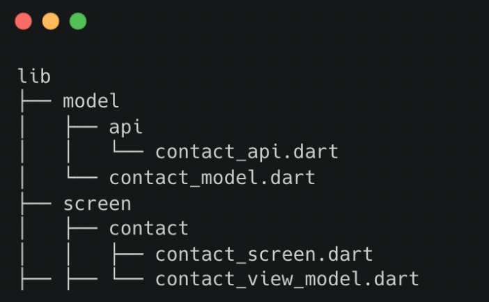
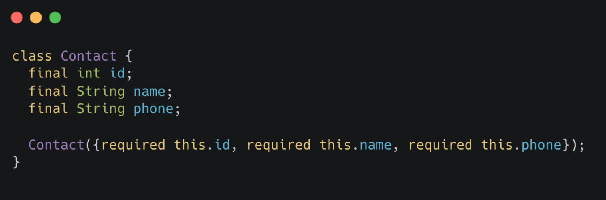
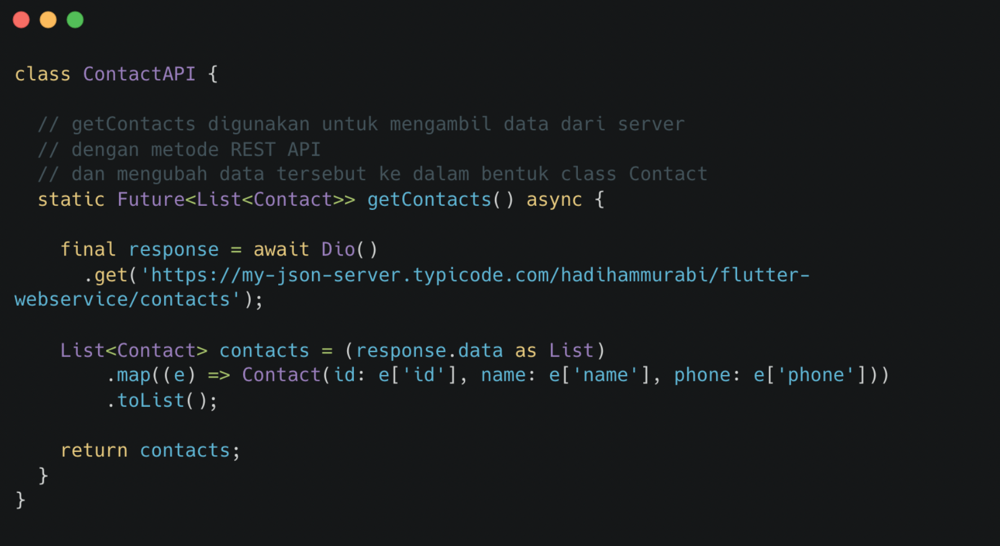
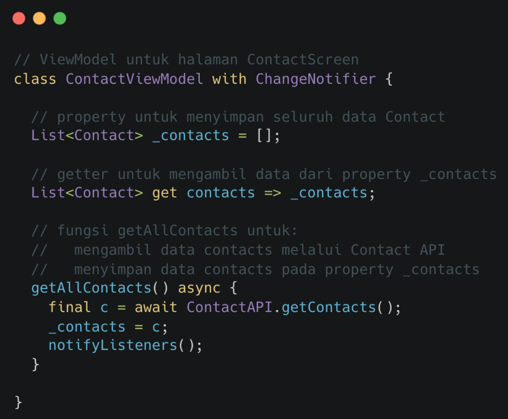
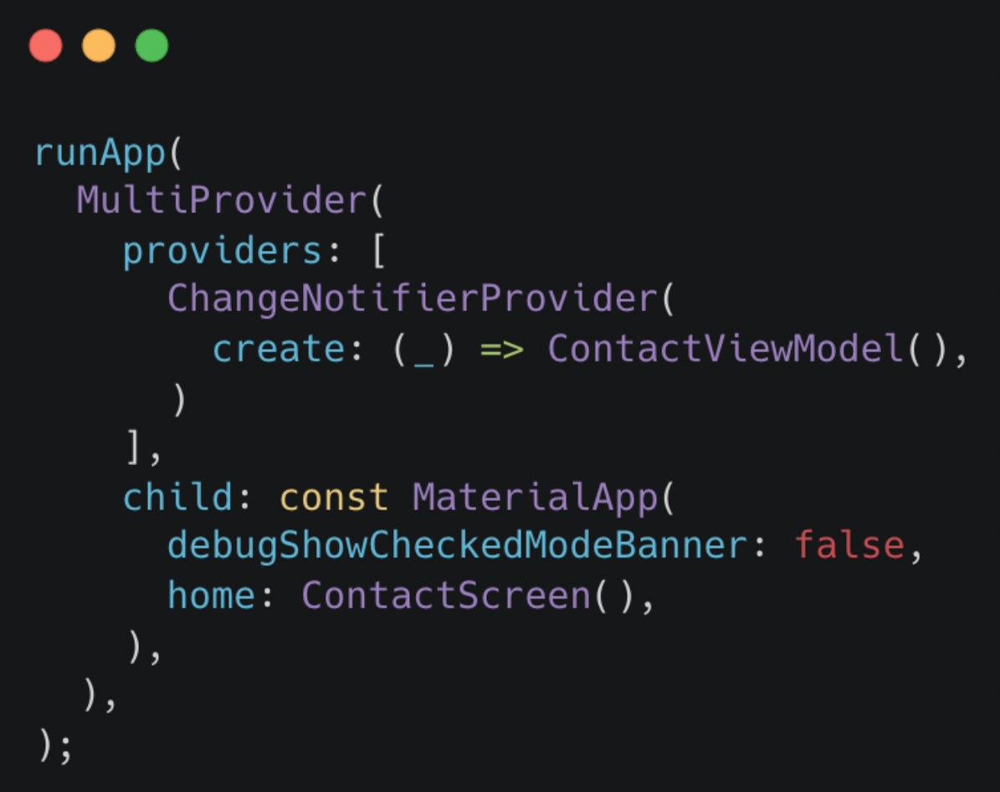
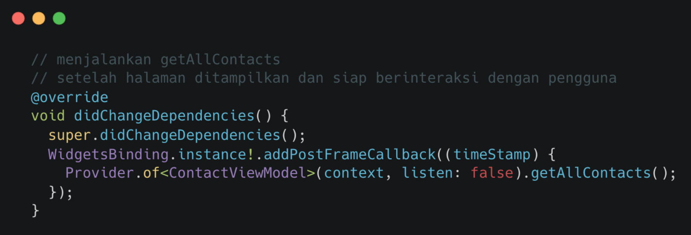
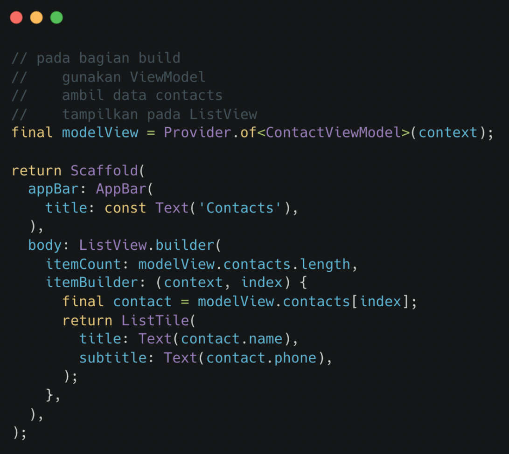
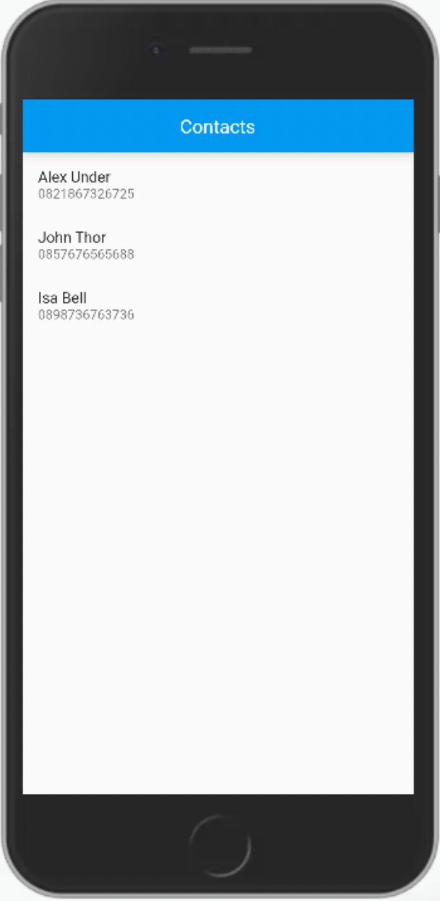

# (26) MVVM Architecture

## Data Diri
Nomor Urut : 1_018FLC_0

Nama : Rayhan Naufal Herlano

## Summary 
### MVVM
>Berfungsi untuk memisahkan logic dengan tampilan (View) ke dalam viewModel

Keuntungan :
1. Reusability

    Jika ada beberapa tampilan yang memrlukan alur logic yang sama, mereka bisa menggunakan ViewModel yang sama

2. Maintainability
    
    Mudah dirawat karena pekerjaan terkait tampilan tidak tertumpuk bersama logic

3. Testability

    Pengujian menjadi terpisah antara pengujian tampilan dengan pengujian logic sehingga dapat meningkatkan produktivitas pada pengujian

### Melakukan MVVM
Struktur direktori :
- Model memiliki 2 bagian, yaitu bentuk data yang akan digunakan dan sumber dari data tersebut.
- Tiap screen diletakkan dalam sebuah direktori yang di dalamnya terdapat View dan ViewModel

### Model :
- Bentuk data yang akan digunakan, dibuat dalam bentuk class
- Data-data yang dimuat, di letakkan pada property

Model API :

### ViewModel
- Menyimpan data-data dan logic yang diperlukan halaman ContactScreen
- Jika widget lain memerlukan logic yang sama, dapat menggunakan ViewModel ini juga

Mendaftarkan ViewModel
- Menggunakan MultiProvider agar dapat menggunakan banyak ViewModel
- MaterialApp sebagai child utama

### View
Menggunakan StatefulWidget

Menampilkan Data di View
- Letakkan pada bagian build
- Menggunakan getters yang ada pada ViewModel
- Data dapat langsung ditampilkan pada widget

Hasil Akhir
- Sebuah halaman aplikasi
- Terdapat AppBar yang berjudul contacts
- Terdapat list data contact berupa nama dan nomor telepon

