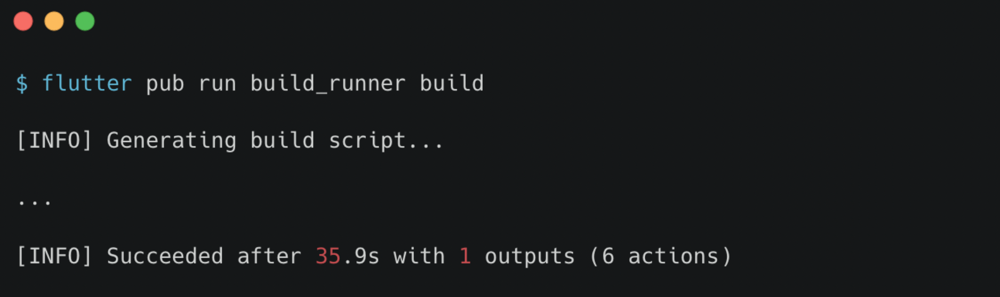

# (27) Finite State Machine & Unit Testing

## Data Diri
Nomor Urut : 1_018FLC_0

Nama : Rayhan Naufal Herlano

## Summary 
## Finite State Machine

### Finite State Machine
>Mesin yang memiliki sejumlah state, dan tiap state menunjukkan apa yang terjadi sebelumnya

Contoh

Terdapat 3 state yang menunjukkan kejadian dalam suatu proses.
- IDDLE saat tidak terjadi proses
- RUNNING saat proses sedang berjalan
- ERROR saat proses gagal diselesaikan

Contoh Sukses :
- IDDLE berubah menjadi RUNNING saat proses berjalan
- RUNNING kembali menjadi IDDLE saat proses selesai

Contoh gagal :
- IDDLE berubah menjadi RUNNING saat proses berjalan
- RUNNING menjadi ERROR saat terjadi kegagalan
- ERROR kembali menjadi IDDLE

### Implementasi pada View-Model

### Menambahkan Enum
Membuat enum untuk masing-masing state:
- none saat IDDLE
- loading saat RUNNING
- error saat ERROR

### Menambah Getter-Setter
Membuat getter-setter untuk menyimpan state dari widget

### Gunakan State
Tiap proses yang perlu state tersebut, dapat memanfaatkannya

### Implementasi pada Widget

### Perbedaan tampilan tiap state
Informasi finite state dapat berguna untuk menentukan seperti apa tampilan yang dimunculkan 

Saat state menunjukkan RUNNING, maka ditampilkan progress indicator :

Saat state menunjukkan IDDLE, maka ditampilkan data yang didapatkan

Saat state menunjukkan ERROR, maka ditampilkan pesan yang menunjukkan bahwa proses tidak dapat diselesaikan

## Unit Test

### Unit Test
>Salah satu jenis pengujian pada perangkat lunak, pengujian dilakukan pada unit dalam perangkat lunak, dan unit yang dimaksud umumnya adalah fungsi method

### Tujuan Unit Test
>Memastikan fungsi dapat mengola beberapa jenis input, memastikan hasil dari suatu fungsi atau method sudah sesuai, dan menjadi dokumentasi

### Bagaimana Melakukan Unit Test?
Manual :
Unit dijalankan dan dicek hasilnya secara manual

Automated :
Menulis script yang dapat dijalankan berkali-kali menggunakan test runner

### Menambahkan Dependencies
- Tambahkan test, pada bagian dev_dependencies dalam file pubspec.yaml
- Jalankan pada terminal perintah di bawah :
    
    > flutter pub get 

### Membuat file Test
- Pada folder test, tambahkan folder baru model/api
- Dalam folder tersebut, tambahkan file baru contact_api_test.dart

### Menulis Test Script
- Import package test
- Membuat test case
- Menjalankan fungsi
- Cek hasil dengan expect

### Menjalankan Test
Menggunakan perintah 
>flutter test

### Mengelompokkan Test
- Beberapa test dengan subjek yang sama diletakkan dalam sebuah kelompok
- Dilakukan dengan menggunakan Group

### Mocking
- Proses yang terikat dengan sistem eksternal dapat memengaruhi berjalannya pengujian
- Pengaruh tersebut dapat mengganggu proses pengujian
- Dilakukan mocking untuk menghindari masalah-masalah tersebut

### Cara kerja mocking
- Suatu object dibuat bentuk tiruannya
- Bentuk tiruan tersebut memiliki input dan output yang sama dengan yang asli
- Bentuk tiruan menghilangkan ketergantungan pada sistem eksternal

### Menambah Dependencies
- Tambahkan mockito dan build_runner, pada bagian dev_dependencies dalam file pubspec.yaml
- Jalankan flutter pub get pada terminal

### Melakukan Mocking
- Mengubah kode agar dapat dilakukan mocking

Memasang annotation untuk membentuk mock

Membuat file mock dengan menjalankan perintah
>flutter pub run build_runner build

Menggunakan mock yang telah dibuat

### Menjalankan Test

Dengan mocking, test berjalan lebih cepat

