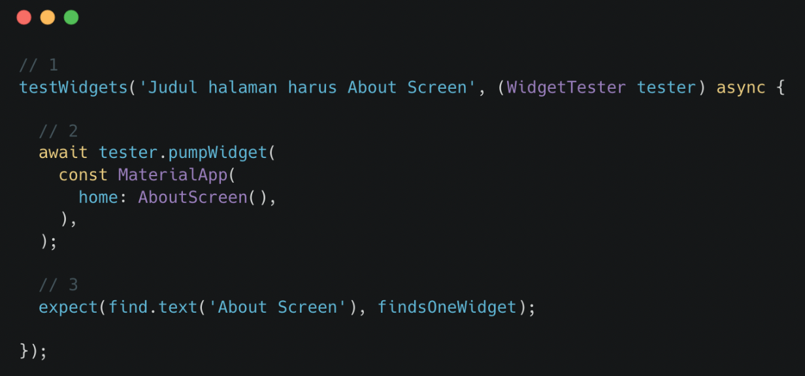

# (28) UI Testing

## Data Diri
Nomor Urut : 1_018FLC_0

Nama : Rayhan Naufal Herlano

## Summary 
## UI Testing

### UI Testing
>UI testing merupakan pengujian yang dilakukan pada tampilan suatu aplikasi untuk memutuskan aplikasi dapat menerima interaksi dan memberi respon kepada pengguna.

UI Testing di Flutter
>Disebut juga widget testing sehingga pengujian dilakukan pada widgets dengan menuliskan script yang dapat dijalankan secara otomatis

Keuntungan UI Testing :
- Memastikan seluruh widget memberi tampilan yang sesuai
- Memastikan seluruh interaksi dapat diterima dengan baik
- Menjadi ketentuan yang harus diikuti saat diperlukan perubahan pada widget

### Melakukan UI Testing
Instalasi Package Testing
>Pada umumnya, package testing sudah ter-install sejak project pertama kali dibuat. Tetapi, cara ini dapat dilakukan, jika ingin meng-install secara manual.

Penulisan Script Testing

- Dilakukan pada folder test
- Nama file harus diikuti _test.dart, contoh contact_test.dart 
- Tiap file berisi fungsi main() yang di dalamnya dapat dituliskan script testing
- Tiap skenario pengujian disebut test case

Script Testing
- Test case diawali dengan testWidgets dan diberi judul
- Simulasi proses mengaktifkan halaman AboutScreen
- Memeriksa apakah di halaman tersebut terdapat teks "About Screen"

### Menjalankan Testing
- Perintah flutter test akan menjalankan seluruh file test yang dibuat
- Hasil dari perintah ini adalah lamanya waktu pengujian, total pengujian yang dilakukan, dan pesan bahwa pengujian berhasil

